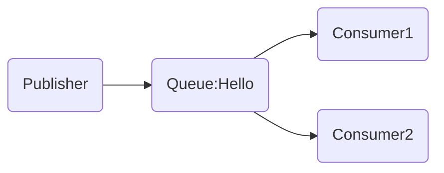
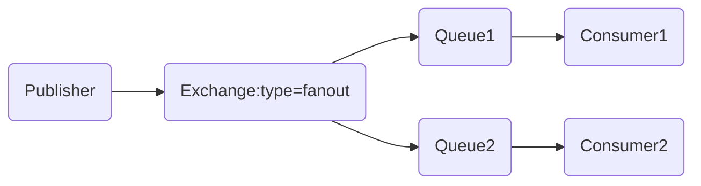
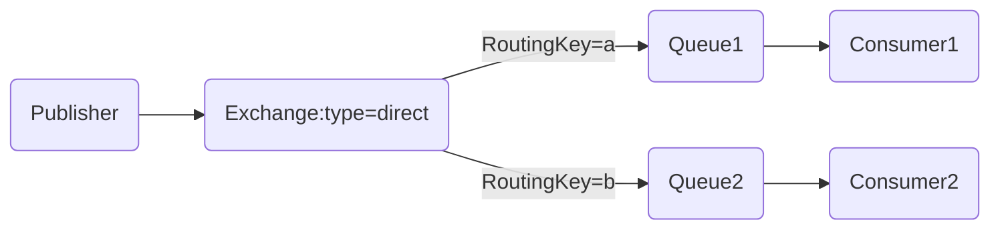
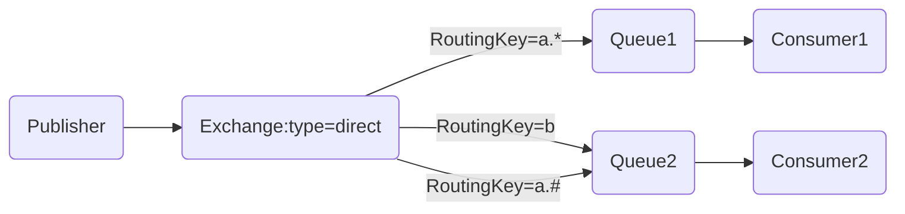

# PHP RabbitMQ消息队列使用


## 1. 简介

RabbitMQ是部署最广泛的开源消息代理。

RabbitMQ有成千上万的用户，是最受欢迎的开源消息代理之一。从T-Mobile 到Runtastic，RabbitMQ在全球范围内的小型初创企业和大型企业中都得到使用。

RabbitMQ轻巧，易于在内部和云中部署。它支持多种消息传递协议。RabbitMQ可以部署在分布式和联合配置中，以满足大规模，高可用性的要求。

RabbitMQ可在许多操作系统和云环境上运行，并为大多数流行语言提供了广泛的开发人员工具。


## 2. 安装

为方便，我们使用docker快速安装体验：
```
docker run -d --hostname my-rabbit --name some-rabbit -p 8080:15672 -p 5672:5672 rabbitmq:3-management-alpine
```
更多平台安装方式请查看：https://www.rabbitmq.com/download.html


## 3. 使用


### 3.1. 安装php-amqplib客户端

先确保已安装Composer

方式一：直接在项目下运行命令：

```
composer require php-amqplib/php-amqplib
```

方式二：将`"php-amqplib/php-amqplib": ">=2.9.0"`添加至composer.json中：

```
{
    "require": {
        "php-amqplib/php-amqplib": ">=2.9.0"
    }
}
```

然后运行

```
composer install
```

### 3.2. 生产消息


```mermaid
graph LR
Publisher-->Queue:name=Hello
```

```
require_once __DIR__ . '/../../vendor/autoload.php';

use PhpAmqpLib\Connection\AMQPStreamConnection;
use PhpAmqpLib\Message\AMQPMessage;


$connection = new AMQPStreamConnection('localhost', 5672, 'guest', 'guest');

$channel = $connection->channel();
$channel->queue_declare('hello', false, false, false, false);

$msg = new AMQPMessage('Hello World!');
$channel->basic_publish($msg, '', 'hello');
echo " [x] Sent 'Hello World!'\n";

$channel->close();
$connection->close();
```

### 3.3. 消费消息


```
require_once __DIR__ . '/../../vendor/autoload.php';

use PhpAmqpLib\Connection\AMQPStreamConnection;


$connection = new AMQPStreamConnection('localhost', 5672, 'guest', 'guest');


$channel = $connection->channel();
$channel->queue_declare('hello', false, false, false, false);

echo " [*] Waiting for messages. To exit press CTRL+C\n";

$callback = function ($msg) {
    echo ' [x] Received ', $msg->body, "\n";
};

$channel->basic_consume('hello', '', false, true, false, false, $callback);

while ($channel->is_consuming()) {
    $channel->wait();
}
```

### 3.4. 循环调度



如果我们积压的消息越来越多，我们可以增加更多的消费者，这样就可以更快的消费消息。
默认情况下，RabbitMQ将按顺序将每个消息发送给下一个消费者。平均每个消费者都会消费到相同数量的消息。这种分发消息的方式称为循环。

**示例：**

1）启用两个消费者：
```
# shell 1
php cosumer.php
# => [*] Waiting for messages. To exit press CTRL+C

# shell 2
php worker.php
# => [*] Waiting for messages. To exit press CTRL+C
```

2）生产5个消息：
```
# shell 3
php producer.php First message.
php producer.php Second message..
php producer.php Third message...
php producer.php Fourth message....
php producer.php Fifth message.....
```

3）查看消费者消费的消息情况：
```
# shell 1
php worker.php
# => [*] Waiting for messages. To exit press CTRL+C
# => [x] Received 'First message.'
# => [x] Received 'Third message...'
# => [x] Received 'Fifth message.....'

# shell 2
php worker.php
# => [*] Waiting for messages. To exit press CTRL+C
# => [x] Received 'Second message..'
# => [x] Received 'Fourth message....'
```

### 3.5. 消息确认

执行任务可能需要几秒钟。您可能想知道，如果其中一个使用者开始一项漫长的任务并仅部分完成而死掉，会发生什么。使用我们当前的代码，RabbitMQ一旦向消费者发送了一条消息，便立即将其标记为删除。在这种情况下，如果您杀死一个工人，我们将丢失正在处理的消息。我们还将丢失所有发送给该特定工作人员但尚未处理的消息。

但是我们不想丢失任何任务。如果一个工人死亡，我们希望将任务交付给另一个工人。

为了确保消息永不丢失，RabbitMQ支持 消息确认。消费者发送回一个确认（acknowledgement），以告知RabbitMQ已经接收，处理了特定的消息，并且RabbitMQ可以自由删除它。

如果使用者在不发送确认的情况下死亡（其通道已关闭，连接已关闭或TCP连接丢失），RabbitMQ将了解消息未完全处理，并将重新排队。如果同时有其他消费者在线，它将很快将其重新分发给另一位消费者。这样，即使工人偶尔死亡，您也可以确保不会丢失任何消息。

没有任何消息超时；消费者死亡时，RabbitMQ将重新传递消息。即使处理一条消息花费非常非常长的时间也没关系。

消息确认默认为关闭。现在是时候通过将第四个参数basic_consume设置为false来打开它们了 （true表示没有ack），并在完成任务后从工作人员发送适当的确认。

```
$callback = function ($msg) {
    echo ' [x] Received ', $msg->body, "\n";
    sleep(3);
    echo ' [x] Finished  ' . PHP_EOL;
    $msg->delivery_info['channel']->basic_ack($msg->delivery_info['delivery_tag']);
};

$channel->basic_consume('hello', '', false, false, false, false, $callback);
```

### 3.6. 消息持久性

我们已经学会了如何确保即使消费者死亡，任务也不会丢失。但是，如果RabbitMQ服务器停止，我们的任务仍然会丢失。

RabbitMQ退出或崩溃时，它将忘记队列和消息，除非您告知不要这样做。要确保消息不会丢失，需要做两件事：我们需要将队列和消息都标记为持久性。

首先，我们需要确保该队列将在RabbitMQ节点重启后继续存在。为此，我们需要将其声明为持久的。为此，我们将第三个参数作为true传递给queue_declare：


```
$channel->queue_declare('hello', false, true, false, false);
```

同时在生产者代码和消费者代码中设置为```true```。

我们需要将消息标记为持久消息-通过设置delivery_mode = 2 message属性，AMQPMessage将其作为属性数组的一部分。


```
$msg = new AMQPMessage(
    $data, 
    array('delivery_mode' => AMQPMessage::DELIVERY_MODE_PERSISTENT)
);
```

### 3.7 Exchange

Exchange是Publisher和Queue的中间层，Publisher不直接发送消息给Queue，而是发给Exchange，然后再由Exchange决定路由转发至哪个Queue。  

RabbitMQ消息传递模型中的核心思想是生产者从不将任何消息直接发送到队列。实际上，生产者经常甚至根本不知道是否将消息传递到任何队列。

相反，生产者只能将消息发送到交换机(Exchange)。一方面，它接收来自生产者的消息，另一方面，将它们推入队列。交换机必须确切知道如何处理收到的消息。是否应将其附加到特定队列？是否应该将其附加到许多队列中？还是应该丢弃它。规则由交换类型定义 。

Exchange的三种常用类型：
1. Direct Exchange
2. Topic Exchange
3. Fanout Exchange


**Fanout Exchange**

我们先了解Fanout Exchange，Fanout Exchange 会忽略 RoutingKey 的设置，直接将 Message 广播到所有绑定的 Queue 中。



**Direct Exchange**

Direct Exchange 是 RabbitMQ 默认的 Exchange，完全根据 RoutingKey 来路由消息。设置 Exchange 和 Queue 的 Binding 时需指定 RoutingKey（一般为 Queue Name），发消息时也指定一样的 RoutingKey，消息就会被路由到对应的Queue。

如下图所示，如过publisher绑定的RoutingKey=a，当publisher发送消息时，只有consumer1能收到此消息。



**Topic Exchange**

Topic Exchange 和 Direct Exchange 类似，也需要通过 RoutingKey 来路由消息，区别在于Direct Exchange 对 RoutingKey 是精确匹配，而 Topic Exchange 支持模糊匹配。分别支持*和#通配符，*表示匹配一个单词，#则表示匹配没有或者多个单词。

topic routingkey匹配示例：

加入我们有如下一组routeking：a, a.b, a.c, a.b.c。

a  能匹配到： a  
a.*能匹配到：a.b, a.c  
a.#能匹配到：a.b, a.c, a.b.c  
\* 能匹配到：a  
\# 能匹配到：所有

如下图所示，如果publisher绑定的RoutingKey=a.b，当publisher发送消息时，consumer1和consumer2都能收到此消息，因为Queue2绑定的RoutingKey=a.#能匹配到a.b；如果publisher绑定的RoutingKey=a.b.c，当publisher发送消息时，则只有consumer2能收到此消息。




### 3.8. 消息广播(发布/订阅)

要实现消息广播，我们用到的Exchange类型为：```fanout```

创建fanout类型的Exchange，并将其命名为logs：
```
$channel->exchange_declare('logs', 'fanout', false, false, false);
```

创建一个临时队列，并将其绑定到交换机（Exchange）中：

```
list($queueName, ,) = $channel->queue_declare('', false, false, true, false);
$channel->queue_bind($queueName, 'logs');
```

接收消息广播：
```
$callback = function ($msg) {
    echo ' [x] Received ', $msg->body, "\n";
    $msg->delivery_info['channel']->basic_ack($msg->delivery_info['delivery_tag']);
};

$channel->basic_consume($queueName, '', false, false, false, false, $callback);
```

